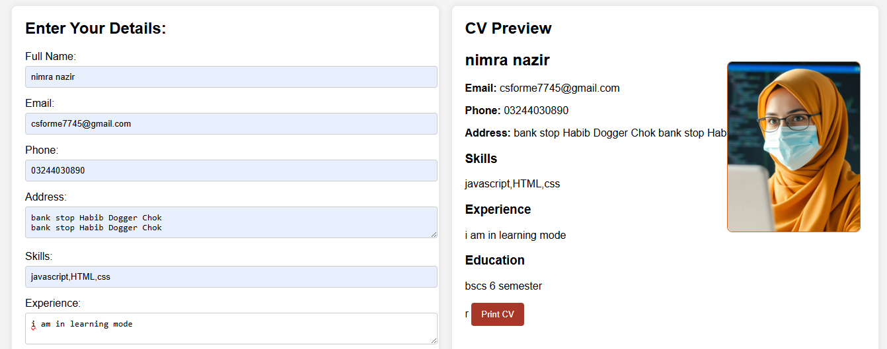
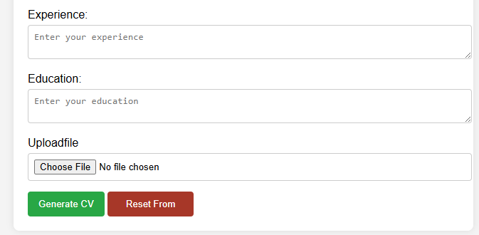

# 📄 CV Maker Project

A simple and interactive **CV Maker Web Application** that allows users to create and generate professional CVs easily using a clean and user-friendly interface.

---

## 🚀 Live Project 

[view live website](https://nimra13045.github.io/CV-Maker-porject/)

---
🎥 **Project Demo Video:**  
https://www.youtube.com/shorts/8G9CYP1Dww0  

---

## 🧑‍💻 About the Project

The **CV Maker Project** is designed to help users quickly build their resumes by filling in basic information such as:

- Personal Details  
- Education  
- Skills  
- Experience  
- Contact Information  

The system then generates a structured and professional CV layout.

---

## ✨ Features

- Easy-to-use form interface  
- Instant CV generation  
- Clean and responsive design  
- Beginner-friendly project  
- Useful for students and job seekers  

---

## 🛠️ Technologies Used

- HTML5  
- CSS3  
- JavaScript  

---

## 📌 Purpose

This project is created for learning front-end development and understanding how form data can be used to dynamically generate a structured document like a CV.

---

## 👩‍💻 Author

**Nimra Nazir**

---

## 📷 Preview

---

## ⭐ If you like this project

Feel free to ⭐ star the repository and share it with others!
